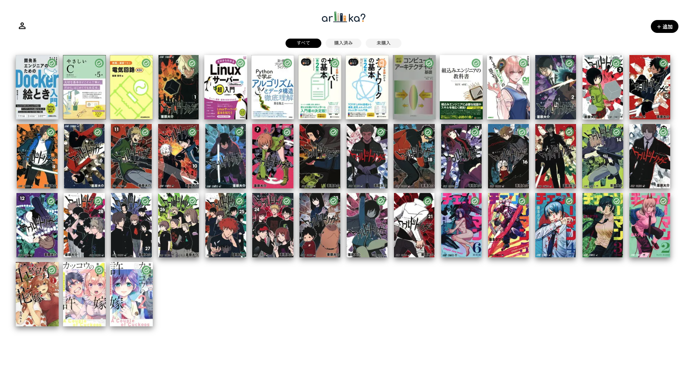
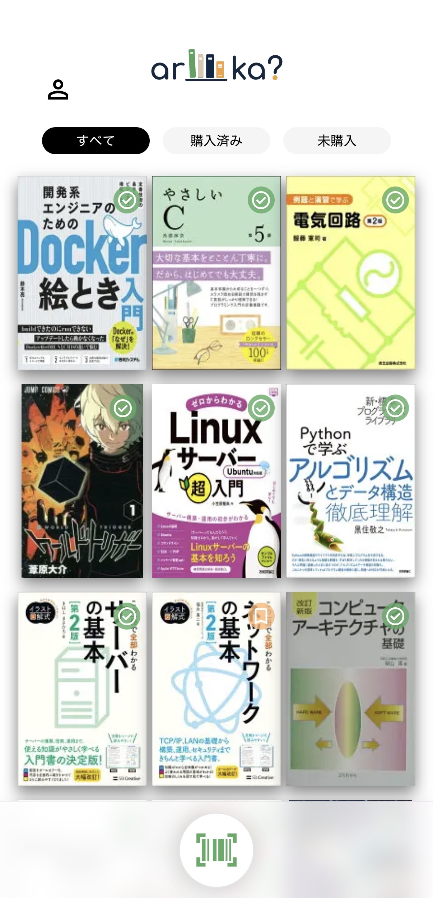

<table align="center">
  <tr>
    <td>
      
    </td>
    <td>
      
    </td>
  </tr>
</table>

  
  
  
  

  

> [!NOTE]
> 現在は複数端末間でのデータ同期を実現するため、Googleログインを必須としています。 
> 今後はログイン不要で利用できる範囲を拡大する予定です。

---

## 概要

aruka? は、「あれ、この本持ってたっけ？」をすぐ確認できる書籍管理アプリ。
自分が持っている本を登録・検索して、書店やオンラインで本を買う前に重複購入を防ぐこと

バーコードを読み取るだけで所持状況を確認でき、外出先でも簡単に利用できます。

---

## 制作背景

### 課題

漫画や書籍を購入する際に、何巻まで所持しているかを忘れてしまい、同じ巻を購入してしまうことがありました。

また、既存の書籍管理サービスにはレビュー機能やSNS機能など多くの機能がありますが、「持っている本をすぐ確認したい」という用途には機能が多く、手軽に使いづらいと感じました。

### 目的

外出先でも所持状況をすぐに確認でき、重複購入を防げる書籍管理アプリを作ることを目的としました。

### 工夫した点

- ZXingを利用し、ISBNバーコードを読み取ることで手入力なしで書籍を登録できるようにしました。
- 一度取得した書籍情報はデータベースに保存し、同じISBNでは外部APIを再度呼び出さないようにしました。
- 書店で利用することを想定し、スマートフォンでも操作しやすいUIを意識しました。

---

## 技術スタック・選定理由

### Next.js

フロントエンドとバックエンドを同一プロジェクトで管理できるため採用しました。 
個人開発では開発速度を重視したかったため、API Routesを利用できるNext.jsを選択しました。

### TypeScript

型安全性を確保し、実装時のミスを減らすため採用しました。

### ZXing

ISBNバーコードを読み取るために採用しました。
ユーザーが手入力することなく書籍を登録できるようにしています。

### Supabase

Next.js との連携がしやすく、これまでのハッカソン等でも利用経験があったため採用しました。
また、個人開発では短期間で形にすることを重視していたため、データベースの構築や管理にかかる実装コストを抑えながら、素早く開発を進められる点が適していると考えました。

### Clerk

認証機能を手軽に導入でき、ログイン画面などのUIも綺麗に実装しやすく、カスタマイズ性が高いため採用しました。

---
